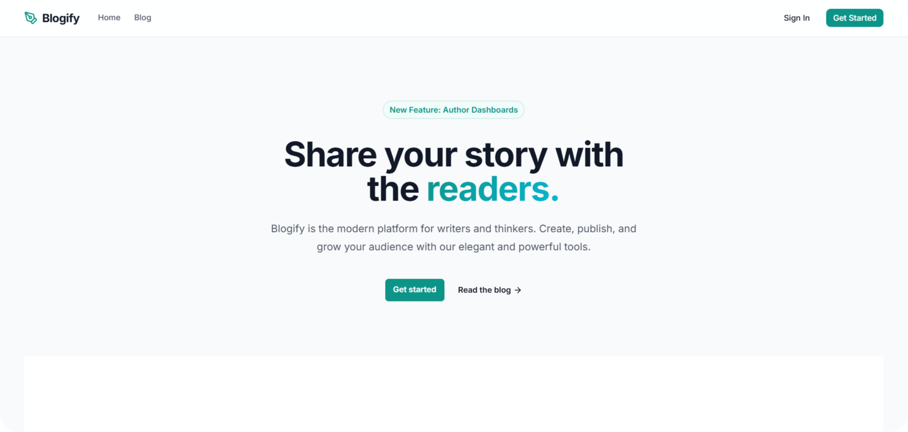

# Blogify - A Modern Blogging Platform


<p align="center">
  A modern, secure, and feature-rich blog application built with Symfony 6.1 and PostgreSQL.
</p>

<p align="center">
  <a href="https://github.com/reblox01/blogify/stargazers"></a>
  <a href="https://github.com/reblox01/blogify/network/members"></a>
  <a href="https://github.com/reblox01/blogify/blob/main/LICENSE"></a>
  <a href="https://php.net"></a>
  <a href="https://symfony.com"></a>
  <a href="https://supabase.com"></a>
</p>

---

## 👨‍🚀 Introduction

**Blogify** is a professional-grade blogging platform designed for developers and content creators who prioritize security and performance. Leveraging the power of **Symfony 6.1**, it provides a robust architecture for managing posts, authors, and complex data relations with ease.

---

## ✨ Features

*   **📰 Blog Engine**: Full-featured system with posts, authors, and categorization.
*   **📝 Unique Sluggable**: Automatic generation of SEO-optimized, collision-free slugs using Symfony's `SluggerInterface` with unique ID suffixes.
*   **🏷️ Tagging**: Add tags to posts for better categorization and searchability.
*   **📸 Secure Image Upload**: Advanced imagery system with **AES-256-CBC Encryption** and **HMAC-SHA256** validation. Images are processed (including Base64 support for cropping) and stored securely as encrypted blobs in the database.
*   **🛠️ Admin Dashboard**: Secure administration area to manage all content dynamically.
*   **👤 User Authentication**: Complete user system with registration, login, and role-based access control (RBAC).
*   **🔐 Row Level Security (RLS)**: Advanced PostgreSQL RLS integration to ensure data isolation at the database level.
*   **📨 Messenger Integration**: Support for asynchronous message handling and background tasks.
*   **🐳 Docker Ready**: Optimized for containerized environments with pre-configured Compose files.

---

## 🚀 Tech Stack

- **Framework**: [Symfony 6.1](https://symfony.com/)
- **Language**: [PHP 8.1+](https://php.net/)
- **Database**: [PostgreSQL](https://www.postgresql.org/) (Hosted on [Supabase](https://supabase.com/) with Row Level Security)
- **Templating**: [Twig](https://twig.symfony.com/)
- **Messaging**: Symfony Messenger
- **DevOps**: Docker, Docker Compose
- **User Interface**: [Tailwind CSS](https://tailwindcss.com/)

---

## 🛠️ Installation

### 1. Requirements
- PHP >= 8.1
- PostgreSQL >= 16
- Composer
- Symfony CLI (optional but recommended)

### 2. Getting Started
```bash
# Clone the repository
git clone https://github.com/reblox01/blogify.git
cd blogify

# Install dependencies
composer install
```

### 3. Environment Configuration
Copy the `.env` file to `.env.local` and configure your database credentials:
```bash
# .env.local
DATABASE_HOST=localhost
DATABASE_PORT=5432
DATABASE_NAME=symfony_blog
DATABASE_USER=postgres
DATABASE_PASSWORD=your_password
APP_SECRET=your_secret_key
```

### 4. Database Setup
Set up the schema and enable **Row Level Security**:
```bash
php bin/console doctrine:migrations:migrate
```

### 5. Launch
```bash
symfony server:start
```

---

## 🔐 Security Note

This project implements **Row Level Security (RLS)** on critical tables (`users`, `posts`, `messenger_messages`). 
- The application connects using a user with `BYPASS RLS` privileges for core operations. 
- In production, ensure your database user roles are correctly partitioned to maintain the integrity of RLS.

---

## 🖥️ Usage

- **Homepage**: `http://localhost:8000/`
- **Admin Panel**: `http://localhost:8000/admin` (Requires `ADMIN` role)

---

## 🤝 Support

If you find this project helpful, consider supporting my work:

[](https://www.buymeacoffee.com/arosck1)
[](https://github.com/sponsors/reblox01)
[](https://paypal.me/sohailkoutari)

---

## 📧 Contact

Feel free to reach out for collaborations or inquiries:

- **Email**: [Contact@sohailkoutari.com](mailto:Contact@sohailkoutari.com)
- **Website**: [sohailkoutari.com](https://sohailkoutari.com/contact)

---

## 📜 License

This project is licensed under the [MIT License](LICENSE).
